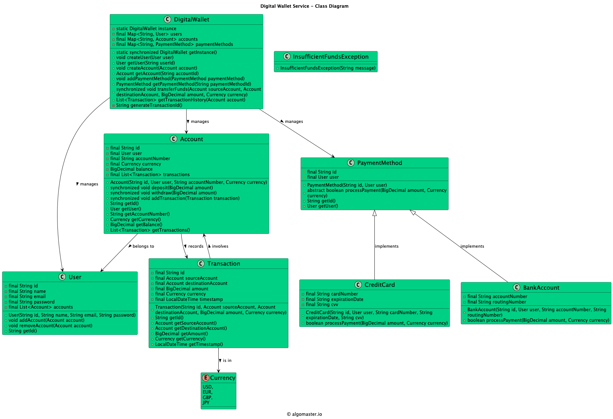

# Designing a Digital Wallet Service

## Requirements
1. The digital wallet should allow users to create an account and manage their personal information.
2. Users should be able to add and remove payment methods, such as credit cards or bank accounts.
3. The digital wallet should support fund transfers between users and to external accounts.
4. The system should handle transaction history and provide a statement of transactions.
5. The digital wallet should support multiple currencies and perform currency conversions.
6. The system should ensure the security of user information and transactions.
7. The digital wallet should handle concurrent transactions and ensure data consistency.
8. The system should be scalable to handle a large number of users and transactions.

## UML Class Diagram

## Implementations
#### [Java Implementation](../solutions/java/src/digitalwalletservice/) 
#### [Python Implementation](../solutions/python/digitalwalletservice/)
#### [C++ Implementation](../solutions/cpp/digitalwalletservice/)
#### [C# Implementation](../solutions/csharp/digitalwalletservice/)
#### [Go Implementation](../solutions/golang/digitalwalletservice/)

## Classes, Interfaces and Enumerations
1. The **User** class represents a user of the digital wallet, with properties such as ID, name, email, password, and a list of accounts.
2. The **Account** class represents a user's account within the digital wallet, with properties like ID, user, account number, currency, balance, and a list of transactions. It provides methods to deposit and withdraw funds.
3. The **Transaction** class represents a financial transaction between two accounts, containing properties such as ID, source account, destination account, amount, currency, and timestamp.
4. The **PaymentMethod** class is an abstract base class for different payment methods, such as credit cards and bank accounts. It defines the common properties and methods for processing payments.
5. The **CreditCard** and **BankAccount** classes are concrete implementations of the PaymentMethod class, representing specific payment methods.
6. The **Currency** enum represents different currencies supported by the digital wallet.
7. The **CurrencyConverter** class provides a static method to convert amounts between different currencies based on predefined exchange rates.
8. The **DigitalWallet** class is the central component of the digital wallet system. It follows the Singleton pattern to ensure only one instance of the digital wallet exists. It provides methods to create users, accounts, add payment methods, transfer funds, and retrieve transaction history. It handles concurrent access to shared resources using synchronization.
9. The **DigitalWalletDemo** class demonstrates the usage of the digital wallet system by creating users, accounts, adding payment methods, depositing funds, transferring funds, and retrieving transaction history.