# 📚 Library Management System

A comprehensive Java-based library management system demonstrating **Object-Oriented Programming**, **SOLID principles**, and **Design Patterns** implementation.

## 🎯 Features

### Core Functionality
- **Book Management** - Add, update, remove, and search books
- **Patron Management** - Register patrons with different membership types
- **Lending System** - Checkout and return books with due date tracking
- **Late Fee Calculation** - Automatic calculation of overdue fees
- **Search Functionality** - Search books by title, author, or ISBN

### Advanced Features
- **Reservation System** - Reserve unavailable books with queue management
- **Multi-Branch Support** - Manage multiple library branches
- **Book Transfer** - Transfer books between branches
- **Recommendation System** - Personalized book recommendations
- **Notification System** - Notify patrons about due dates and availability

## 🏗️ Architecture

### Project Structure
```
librarymanagementsystem/
├── models/                    # Domain entities
│   ├── Book.java
│   ├── Patron.java
│   ├── LoanRecord.java
│   ├── Branch.java
│   └── Reservation.java
├── patterns/                  # Design pattern implementations
│   ├── observer/             # Observer Pattern (Notifications)
│   ├── factory/              # Factory Pattern (Item Creation)
│   └── strategy/             # Strategy Pattern (Late Fees)
├── services/                  # Business logic layer
├── repositories/              # Data access layer
├── exceptions/                # Custom exceptions
├── utils/                     # Utility classes
├── LibraryManagementSystem.java  # Main system (Facade)
└── LibraryDemo.java           # Demo application
```

## 🎨 Design Patterns

### 1. Observer Pattern 👁️
**Purpose:** Notify patrons when reserved books become available

**Implementation:**
- `Subject` interface - Book availability notifications
- `Observer` interface - Patron notification receiver
- `PatronObserver` - Concrete observer for patrons
- `NotificationService` - Manages observers

### 2. Factory Pattern 🏭
**Purpose:** Create different types of library items

**Implementation:**
- `LibraryItemFactory` - Creates books, magazines, and other items
- `LibraryItem` interface - Common interface for all items
- `BookItem`, `MagazineItem` - Concrete implementations

### 3. Strategy Pattern 📊
**Purpose:** Calculate late fees based on different rules

**Implementation:**
- `LateFeeStrategy` interface - Fee calculation strategy
- `BookLateFeeStrategy`, `MagazineLateFeeStrategy` - Different fee calculations
- `PremiumLateFeeStrategy` - Special rates for premium members

### 4. Facade Pattern 🎭
**Purpose:** Provide simplified interface to complex subsystem

**Implementation:**
- `LibraryManagementSystem` - Main facade class
- Coordinates between services, repositories, and business logic

## 🚀 Getting Started

### Prerequisites
- Java 8 or higher
- Maven (optional, for dependency management)

### Running the Application
```bash
# Compile the project
javac -cp . librarymanagementsystem/*.java librarymanagementsystem/**/*.java

# Run the demo
java librarymanagementsystem.LibraryDemo
```

### Usage Example
```java
// Initialize the system
LibraryManagementSystem library = initializeSystem();

// Add a book
Book book = new Book("978-0134685991", "Effective Java", "Joshua Bloch", 2018);
library.addBook(book, "branch-001");

// Register a patron
Patron patron = new Patron("P001", "John Doe", "john@example.com", PatronType.REGULAR);
library.registerPatron(patron);

// Checkout a book
library.checkoutBook("978-0134685991", "P001");
```

## 🏛️ SOLID Principles

This project demonstrates the five SOLID principles:

- **S** - **Single Responsibility Principle**: Each class has one reason to change
- **O** - **Open/Closed Principle**: Open for extension, closed for modification
- **L** - **Liskov Substitution Principle**: Derived classes are substitutable for base classes
- **I** - **Interface Segregation Principle**: Clients shouldn't depend on unused interfaces
- **D** - **Dependency Inversion Principle**: Depend on abstractions, not concretions

## 📋 Key Classes

### Domain Models
- **`Book`** - Represents a library book with ISBN, title, author, and status
- **`Patron`** - Represents a library member with borrowing history and limits
- **`LoanRecord`** - Tracks book loans with due dates and late fees
- **`Branch`** - Represents library locations with inventory management
- **`Reservation`** - Handles book reservations and queue management

### Services
- **`BookService`** - Manages book operations and search functionality
- **`PatronService`** - Handles patron registration and management
- **`LoanService`** - Manages book checkout and return processes
- **`ReservationService`** - Handles book reservations and notifications

### Repositories
- **`BookRepository`** - Data access layer for books
- **`PatronRepository`** - Data access layer for patrons
- **`LoanRepository`** - Data access layer for loan records

## 🧪 Testing

The system includes comprehensive business logic validation:
- Input validation for all user inputs
- Business rule enforcement (borrowing limits, availability checks)
- Error handling with custom exceptions
- State management for books and loans


## 📊 UML Class Diagram

```mermaid
classDiagram
    %% Core Domain Models
    class Book {
        -String isbn
        -String title
        -String author
        -int publicationYear
        -BookStatus status
        -String currentBranchId
        +Book(isbn, title, author, year)
        +markAsCheckedOut()
        +markAsReturned()
        +markAsReserved()
        +isAvailable()
    }
    
    class Patron {
        -String patronId
        -String name
        -String email
        -String phoneNumber
        -PatronType patronType
        -List borrowingHistory
        -List currentlyBorrowedBooks
        -int maxBooksAllowed
        +canBorrowMoreBooks()
        +addBorrowedBook(Book)
        +removeBorrowedBook(Book)
    }
    
    class LoanRecord {
        -String loanId
        -Book book
        -Patron patron
        -LocalDate checkoutDate
        -LocalDate dueDate
        -LocalDate returnDate
        -double lateFee
        -LoanStatus status
        +returnBook(LocalDate)
        +calculateLateFee(LocalDate)
        +isOverdue()
    }
    
    class Branch {
        -String branchId
        -String branchName
        -String address
        -Map inventory
        +addBook(Book)
        +removeBook(String)
        +getAvailableBooks()
    }
    
    class Reservation {
        -String reservationId
        -String isbn
        -String patronId
        -LocalDateTime reservationDate
        -LocalDateTime expirationDate
        -ReservationStatus status
        +fulfill()
        +cancel()
        +expire()
    }
    
    %% Factory Pattern Classes
    class LibraryItem {
        <<interface>>
        +getItemId() String
        +getTitle() String
        +getItemType() String
        +calculateLateFee(int) double
        +isAvailable() boolean
    }
    
    class BookItem {
        -Book book
        +getItemId() String
        +getTitle() String
        +getItemType() String
        +calculateLateFee(int) double
        +isAvailable() boolean
    }
    
    class MagazineItem {
        -String issueNumber
        -String title
        +getItemId() String
        +getTitle() String
        +getItemType() String
        +calculateLateFee(int) double
        +isAvailable() boolean
    }
    
    class LibraryItemFactory {
        <<utility>>
        +createItem(String, Map) LibraryItem
        +createBook(isbn, title, author, year) LibraryItem
        +createMagazine(issueNumber, title) LibraryItem
    }
    
    %% Observer Pattern Classes
    class Subject {
        <<interface>>
        +attach(Observer)
        +detach(Observer)
        +notifyObservers(String)
    }
    
    class Observer {
        <<interface>>
        +update(String)
        +getObserverId() String
    }
    
    class PatronObserver {
        -String patronId
        -String name
        +update(String)
        +getObserverId() String
    }
    
    class BookSubject {
        -List observers
        -String bookId
        +attach(Observer)
        +detach(Observer)
        +notifyObservers(String)
    }
    
    %% Strategy Pattern Classes
    class LateFeeStrategy {
        <<interface>>
        +calculateFee(int) double
        +getStrategyName() String
    }
    
    class BookLateFeeStrategy {
        +calculateFee(int) double
        +getStrategyName() String
    }
    
    class MagazineLateFeeStrategy {
        +calculateFee(int) double
        +getStrategyName() String
    }
    
    class PremiumLateFeeStrategy {
        +calculateFee(int) double
        +getStrategyName() String
    }
    
    %% Service Layer
    class BookService {
        -BookRepository bookRepository
        +addBook(Book, String)
        +updateBook(Book)
        +removeBook(String)
        +searchBooks(String) List
    }
    
    class PatronService {
        -PatronRepository patronRepository
        +registerPatron(Patron)
        +updatePatron(Patron)
        +getPatron(String) Patron
    }
    
    class LoanService {
        -LoanRepository loanRepository
        +checkoutBook(String, String) LoanRecord
        +returnBook(String, String)
        +getOverdueLoans() List
    }
    
    class ReservationService {
        +reserveBook(String, String) Reservation
        +fulfillReservation(String)
        +cancelReservation(String)
    }
    
    %% Repository Layer
    class Repository {
        <<interface>>
        +save(T)
        +findById(String) Optional
        +delete(String)
        +findAll() List
    }
    
    class BookRepository {
        -Map books
        +save(Book)
        +findById(String) Optional
        +findByTitle(String) List
        +findByAuthor(String) List
        +findAvailableBooks() List
    }
    
    class PatronRepository {
        -Map patrons
        +save(Patron)
        +findById(String) Optional
        +findByType(PatronType) List
    }
    
    class LoanRepository {
        -Map loans
        +save(LoanRecord)
        +findById(String) Optional
        +findByPatron(String) List
        +findOverdueLoans() List
    }
    
    %% Main System (Facade)
    class LibraryManagementSystem {
        -BookService bookService
        -PatronService patronService
        -LoanService loanService
        -ReservationService reservationService
        -BranchService branchService
        -RecommendationService recommendationService
        +addBook(Book, String)
        +registerPatron(Patron)
        +checkoutBook(String, String)
        +returnBook(String, String)
        +searchBooks(String) List
    }
    
    %% Utility Classes
    class IdGenerator {
        <<utility>>
        +generateBookId() String
        +generatePatronId() String
        +generateLoanId() String
    }
    
    class Logger {
        <<utility>>
        +info(String)
        +error(String, Exception)
        +warn(String)
    }
    
    %% Enums
    class BookStatus {
        <<enumeration>>
        AVAILABLE
        CHECKED_OUT
        RESERVED
        MAINTENANCE
        LOST
    }
    
    class PatronType {
        <<enumeration>>
        REGULAR
        PREMIUM
        STUDENT
    }
    
    class LoanStatus {
        <<enumeration>>
        ACTIVE
        RETURNED
        OVERDUE
    }
    
    class ReservationStatus {
        <<enumeration>>
        ACTIVE
        FULFILLED
        EXPIRED
        CANCELLED
    }
    
    %% Relationships
    Book --> BookStatus
    Patron --> PatronType
    LoanRecord --> LoanStatus
    Reservation --> ReservationStatus
    
    LoanRecord --> Book
    LoanRecord --> Patron
    Book --> Branch
    
    BookItem ..|> LibraryItem
    MagazineItem ..|> LibraryItem
    LibraryItemFactory --> LibraryItem
    LibraryItemFactory --> BookItem
    LibraryItemFactory --> MagazineItem
    
    PatronObserver ..|> Observer
    BookSubject ..|> Subject
    BookSubject --> Observer
    
    BookLateFeeStrategy ..|> LateFeeStrategy
    MagazineLateFeeStrategy ..|> LateFeeStrategy
    PremiumLateFeeStrategy ..|> LateFeeStrategy
    
    BookService --> BookRepository
    PatronService --> PatronRepository
    LoanService --> LoanRepository
    
    BookRepository ..|> Repository
    PatronRepository ..|> Repository
    LoanRepository ..|> Repository
    
    LibraryManagementSystem --> BookService
    LibraryManagementSystem --> PatronService
    LibraryManagementSystem --> LoanService
    LibraryManagementSystem --> ReservationService
    LibraryManagementSystem --> BranchService
    LibraryManagementSystem --> RecommendationService
```

