# 📚 Library Management System

A comprehensive library management system demonstrating **Object-Oriented Programming (OOP)**, **SOLID principles**, and **Design Patterns** in Java.

---

## 🎯 Features

### Core Features
- ✅ **Book Management** - Add, update, remove, and search books
- ✅ **Patron Management** - Register patrons with different membership types
- ✅ **Lending System** - Checkout and return books with due date tracking
- ✅ **Late Fee Calculation** - Automatic calculation of overdue fees
- ✅ **Search Functionality** - Search books by title, author, or ISBN

### Advanced Features
- ✅ **Reservation System** - Reserve unavailable books with queue management
- ✅ **Multi-Branch Support** - Manage multiple library branches
- ✅ **Book Transfer** - Transfer books between branches
- ✅ **Recommendation System** - Personalized book recommendations
- ✅ **Notification System** - Notify patrons about due dates and availability

---

## 🏗️ Architecture

### Project Structure
librarymanagementsystem/ 
    ├── models/ # Domain entities 
    │
    ├── Book.java 
    │ 
    ├── Patron.java 
    │ 
    ├── LoanRecord.java 
    │ 
    ├── Branch.java 
    │ 
    └── Reservation.java 
    │ 
    ├── patterns/ # Design pattern implementations 
        │ 
        ├── observer/ # Observer Pattern (Notifications) 
        │ 
        │ ├── Observer.java │ 
        │ ├── Subject.java │ 
        │ ├── PatronObserver.java │ 
        │ └── BookSubject.java │ 
    │ │ ├── factory/ # Factory Pattern (Item Creation) 
    │ │ ├── LibraryItem.java 
    │ │ ├── BookItem.java 
    │ │ ├── MagazineItem.java 
    │ │ └── LibraryItemFactory.java 
    │ │ └── strategy/ # Strategy Pattern (Late Fees) 
      │ ├── LateFeeStrategy.java 
      │ ├── BookLateFeeStrategy.java 
      │ ├── MagazineLateFeeStrategy.java 
      │ └── PremiumLateFeeStrategy.java 
    │ ├── services/ # Business logic layer 
    │ ├── BookService.java 
    │ ├── PatronService.java 
    │ ├── LoanService.java 
    │ ├── ReservationService.java 
    │ ├── BranchService.java 
    │ ├── NotificationService.java 
    │ └── RecommendationService.java 
    │ ├── repositories/ # Data access layer 
    │ ├── Repository.java 
    │ ├── BookRepository.java 
    │ ├── PatronRepository.java 
    │ └── LoanRepository.java 
    │ ├── exceptions/ # Custom exceptions 
    │ ├── BookNotFoundException.java 
    │ ├── PatronNotFoundException.java 
    │ └── BookNotAvailableException.java 
    │ ├── utils/ # Utility classes 
    │ ├── IdGenerator.java 
    │ └── Logger.java 
    │ ├── LibraryManagementSystem.java # Main system (Facade) 
    └── LibraryDemo.java # Demo application
---

## 🎨 Design Patterns Implemented

### 1. **Observer Pattern** 👁️
**Purpose:** Notify patrons when reserved books become available

**Implementation:**
- `Subject` interface - Book availability notifications
- `Observer` interface - Patron notification receiver
- `PatronObserver` - Concrete observer for patrons
- `NotificationService` - Manages observers

**Usage:**
```java
// Patron automatically notified when book is returned
reservationService.reserveBook(isbn, patronId);
// When book is returned, observer is notified
library.returnBook(isbn, anotherPatronId);
```

---

## 📊 UML Class Diagram

```mermaid
classDiagram
    %% Core Domain Models
    class Book {
        -String isbn
        -String title
        -String author
        -int publicationYear
        -BookStatus status
        -String currentBranchId
        +Book(isbn, title, author, year)
        +markAsCheckedOut()
        +markAsReturned()
        +markAsReserved()
        +isAvailable()
    }
    
    class Patron {
        -String patronId
        -String name
        -String email
        -String phoneNumber
        -PatronType patronType
        -List borrowingHistory
        -List currentlyBorrowedBooks
        -int maxBooksAllowed
        +canBorrowMoreBooks()
        +addBorrowedBook(Book)
        +removeBorrowedBook(Book)
    }
    
    class LoanRecord {
        -String loanId
        -Book book
        -Patron patron
        -LocalDate checkoutDate
        -LocalDate dueDate
        -LocalDate returnDate
        -double lateFee
        -LoanStatus status
        +returnBook(LocalDate)
        +calculateLateFee(LocalDate)
        +isOverdue()
    }
    
    class Branch {
        -String branchId
        -String branchName
        -String address
        -Map inventory
        +addBook(Book)
        +removeBook(String)
        +getAvailableBooks()
    }
    
    class Reservation {
        -String reservationId
        -String isbn
        -String patronId
        -LocalDateTime reservationDate
        -LocalDateTime expirationDate
        -ReservationStatus status
        +fulfill()
        +cancel()
        +expire()
    }
    
    %% Factory Pattern Classes
    class LibraryItem {
        <<interface>>
        +getItemId() String
        +getTitle() String
        +getItemType() String
        +calculateLateFee(int) double
        +isAvailable() boolean
    }
    
    class BookItem {
        -Book book
        +getItemId() String
        +getTitle() String
        +getItemType() String
        +calculateLateFee(int) double
        +isAvailable() boolean
    }
    
    class MagazineItem {
        -String issueNumber
        -String title
        +getItemId() String
        +getTitle() String
        +getItemType() String
        +calculateLateFee(int) double
        +isAvailable() boolean
    }
    
    class LibraryItemFactory {
        <<utility>>
        +createItem(String, Map) LibraryItem
        +createBook(isbn, title, author, year) LibraryItem
        +createMagazine(issueNumber, title) LibraryItem
    }
    
    %% Observer Pattern Classes
    class Subject {
        <<interface>>
        +attach(Observer)
        +detach(Observer)
        +notifyObservers(String)
    }
    
    class Observer {
        <<interface>>
        +update(String)
        +getObserverId() String
    }
    
    class PatronObserver {
        -String patronId
        -String name
        +update(String)
        +getObserverId() String
    }
    
    class BookSubject {
        -List observers
        -String bookId
        +attach(Observer)
        +detach(Observer)
        +notifyObservers(String)
    }
    
    %% Strategy Pattern Classes
    class LateFeeStrategy {
        <<interface>>
        +calculateFee(int) double
        +getStrategyName() String
    }
    
    class BookLateFeeStrategy {
        +calculateFee(int) double
        +getStrategyName() String
    }
    
    class MagazineLateFeeStrategy {
        +calculateFee(int) double
        +getStrategyName() String
    }
    
    class PremiumLateFeeStrategy {
        +calculateFee(int) double
        +getStrategyName() String
    }
    
    %% Service Layer
    class BookService {
        -BookRepository bookRepository
        +addBook(Book, String)
        +updateBook(Book)
        +removeBook(String)
        +searchBooks(String) List
    }
    
    class PatronService {
        -PatronRepository patronRepository
        +registerPatron(Patron)
        +updatePatron(Patron)
        +getPatron(String) Patron
    }
    
    class LoanService {
        -LoanRepository loanRepository
        +checkoutBook(String, String) LoanRecord
        +returnBook(String, String)
        +getOverdueLoans() List
    }
    
    class ReservationService {
        +reserveBook(String, String) Reservation
        +fulfillReservation(String)
        +cancelReservation(String)
    }
    
    %% Repository Layer
    class Repository {
        <<interface>>
        +save(T)
        +findById(String) Optional
        +delete(String)
        +findAll() List
    }
    
    class BookRepository {
        -Map books
        +save(Book)
        +findById(String) Optional
        +findByTitle(String) List
        +findByAuthor(String) List
        +findAvailableBooks() List
    }
    
    class PatronRepository {
        -Map patrons
        +save(Patron)
        +findById(String) Optional
        +findByType(PatronType) List
    }
    
    class LoanRepository {
        -Map loans
        +save(LoanRecord)
        +findById(String) Optional
        +findByPatron(String) List
        +findOverdueLoans() List
    }
    
    %% Main System (Facade)
    class LibraryManagementSystem {
        -BookService bookService
        -PatronService patronService
        -LoanService loanService
        -ReservationService reservationService
        -BranchService branchService
        -RecommendationService recommendationService
        +addBook(Book, String)
        +registerPatron(Patron)
        +checkoutBook(String, String)
        +returnBook(String, String)
        +searchBooks(String) List
    }
    
    %% Utility Classes
    class IdGenerator {
        <<utility>>
        +generateBookId() String
        +generatePatronId() String
        +generateLoanId() String
    }
    
    class Logger {
        <<utility>>
        +info(String)
        +error(String, Exception)
        +warn(String)
    }
    
    %% Enums
    class BookStatus {
        <<enumeration>>
        AVAILABLE
        CHECKED_OUT
        RESERVED
        MAINTENANCE
        LOST
    }
    
    class PatronType {
        <<enumeration>>
        REGULAR
        PREMIUM
        STUDENT
    }
    
    class LoanStatus {
        <<enumeration>>
        ACTIVE
        RETURNED
        OVERDUE
    }
    
    class ReservationStatus {
        <<enumeration>>
        ACTIVE
        FULFILLED
        EXPIRED
        CANCELLED
    }
    
    %% Relationships
    Book --> BookStatus
    Patron --> PatronType
    LoanRecord --> LoanStatus
    Reservation --> ReservationStatus
    
    LoanRecord --> Book
    LoanRecord --> Patron
    Book --> Branch
    
    BookItem ..|> LibraryItem
    MagazineItem ..|> LibraryItem
    LibraryItemFactory --> LibraryItem
    LibraryItemFactory --> BookItem
    LibraryItemFactory --> MagazineItem
    
    PatronObserver ..|> Observer
    BookSubject ..|> Subject
    BookSubject --> Observer
    
    BookLateFeeStrategy ..|> LateFeeStrategy
    MagazineLateFeeStrategy ..|> LateFeeStrategy
    PremiumLateFeeStrategy ..|> LateFeeStrategy
    
    BookService --> BookRepository
    PatronService --> PatronRepository
    LoanService --> LoanRepository
    
    BookRepository ..|> Repository
    PatronRepository ..|> Repository
    LoanRepository ..|> Repository
    
    LibraryManagementSystem --> BookService
    LibraryManagementSystem --> PatronService
    LibraryManagementSystem --> LoanService
    LibraryManagementSystem --> ReservationService
    LibraryManagementSystem --> BranchService
    LibraryManagementSystem --> RecommendationService
```

