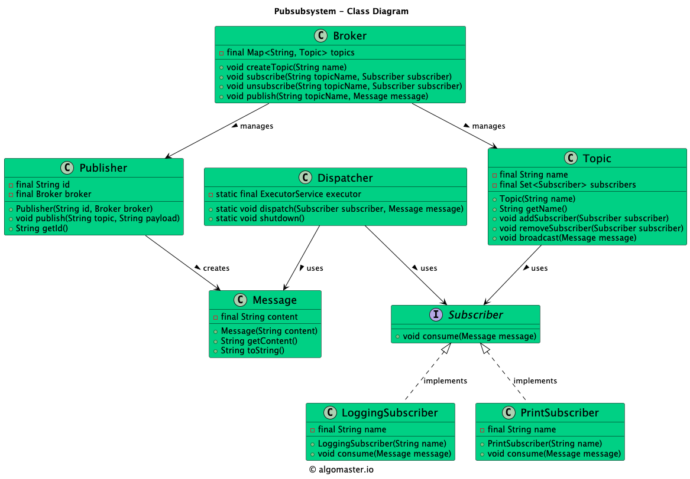

# Pub/Sub System (LLD)

## Problem Statement

Design and implement a Publish-Subscribe (Pub/Sub) system that allows publishers to send messages to topics, and subscribers to receive messages from topics they are interested in. The system should support multiple topics, multiple subscribers per topic, and asynchronous message delivery.

---

## Requirements

- **Topics:** The system supports multiple topics.
- **Publishers:** Publishers can publish messages to any topic.
- **Subscribers:** Subscribers can subscribe to one or more topics and receive messages published to those topics.
- **Multiple Subscribers:** Each topic can have multiple subscribers.
- **Asynchronous Delivery:** Messages are delivered to subscribers asynchronously.
- **Unsubscribe:** Subscribers can unsubscribe from topics.
- **Extensibility:** Easy to add new subscriber types or message processing logic.

---

## Core Entities

- **Broker:** Manages topics, subscriptions, and message delivery.
- **Topic:** Represents a topic to which messages can be published and subscribers can subscribe.
- **Publisher:** Publishes messages to topics via the pubSubService.
- **Subscriber (interface):** Interface for all subscribers, defines the `consume(Message)` method.
- **PrintSubscriber:** A subscriber that prints received messages.
- **LoggingSubscriber:** A subscriber that logs received messages.
- **Message:** Represents a message with a payload.
- **Dispatcher:** Handles asynchronous delivery of messages to subscribers.

---

## Class Design

## UML Class Diagram



### 1. Broker
- **Fields:** Map<String, Topic> topics
- **Methods:** createTopic(String), subscribe(String, Subscriber), unsubscribe(String, Subscriber), publish(String, Message)

### 2. Topic
- **Fields:** String name, List<Subscriber> subscribers
- **Methods:** addSubscriber(Subscriber), removeSubscriber(Subscriber), publish(Message)

### 3. Publisher
- **Fields:** String name, Broker pubSubService
- **Methods:** publish(String topic, String payload)

### 4. Subscriber (interface)
- **Methods:** consume(Message)

### 5. PrintSubscriber
- **Implements:** Subscriber
- **Behavior:** Prints received messages to the console

### 6. LoggingSubscriber
- **Implements:** Subscriber
- **Behavior:** Logs received messages (prints with a log prefix)

### 7. Message
- **Fields:** String payload
- **Methods:** getPayload()

### 8. Dispatcher
- **Methods:** dispatch(Subscriber, Message), shutdown()

---

## Design Patterns Used

- **Observer Pattern:** The Pub/Sub system is a concrete implementation of the Observer pattern. Topics (subjects) maintain a list of subscribers (observers) and notify them asynchronously when a new message is published.
## Example Usage

```java
Broker pubSubService = new Broker();
pubSubService.createTopic("topic1");
pubSubService.createTopic("topic2");

Publisher publisher1 = new Publisher("publisher1", pubSubService);
Subscriber subscriber1 = new PrintSubscriber("PrintSubscriber1");
Subscriber subscriber2 = new LoggingSubscriber("LoggingSubscriber2");

pubSubService.subscribe("topic1", subscriber1);
pubSubService.subscribe("topic2", subscriber2);

publisher1.publish("topic1", "Hello Topic1!");
publisher1.publish("topic2", "Hello Topic2!");
```

---

## Demo

See `PubSubSystemDemo.java` for a sample usage and simulation of the pub/sub system.

---

## Extending the Design

- **Add new subscriber types:** Implement the `Subscriber` interface for custom processing.
- **Add new message types:** Extend the `Message` class for richer payloads.
- **Add filtering or transformation:** Enhance the pubSubService or topic to support message filtering or transformation.

---