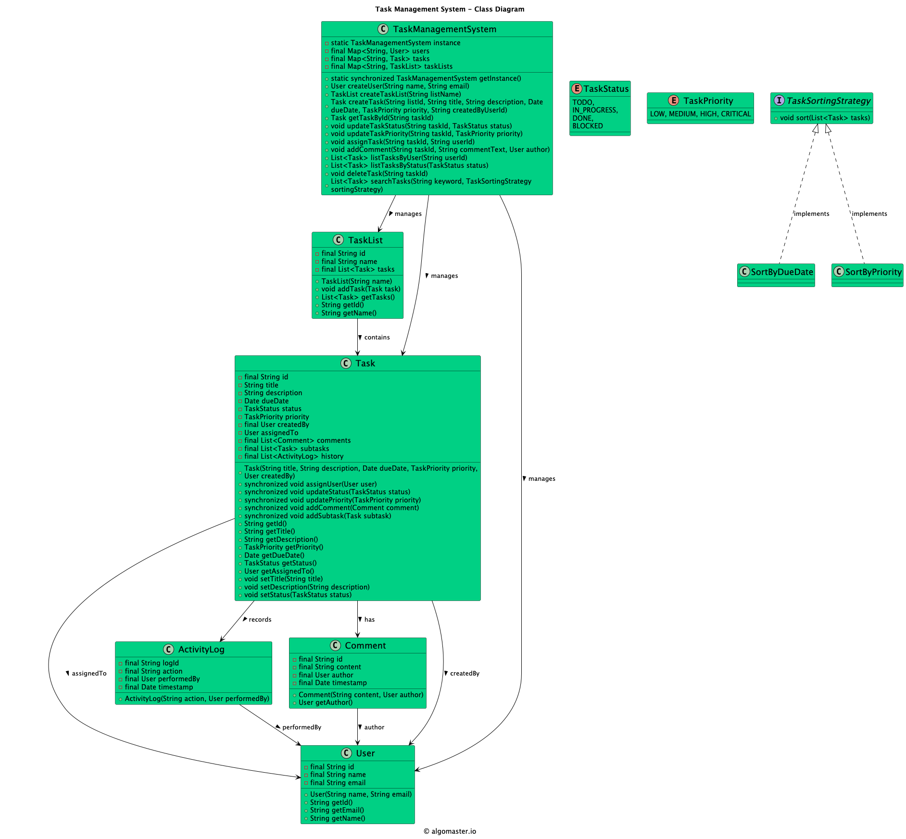

# Task Management System (LLD)

## Problem Statement

Design and implement a Task Management System that allows users to create, assign, update, and track tasks. The system should support task priorities, statuses, comments, and user assignment.

---

## Requirements

- **Task Creation:** Users can create tasks with a title, description, priority, and assignee.
- **Task Assignment:** Tasks can be assigned to users and reassigned as needed.
- **Task Status:** Tasks can have statuses such as TODO, IN_PROGRESS, DONE, etc.
- **Task Priority:** Tasks can have priorities such as LOW, MEDIUM, HIGH.
- **Comments:** Users can add comments to tasks.
- **Task Updates:** Tasks can be updated (status, priority, assignee, etc.).
- **Task Listing:** List all tasks, or filter by status, priority, or assignee.
- **Extensibility:** Easy to add new statuses, priorities, or features.

---

## Core Entities

- **Task:** Represents a task with title, description, status, priority, assignee, and comments.
- **User:** Represents a user who can create, assign, and be assigned tasks.
- **Comment:** Represents a comment on a task.
- **TaskStatus:** Enum for task statuses (TODO, IN_PROGRESS, DONE, etc.).
- **TaskPriority:** Enum for task priorities (LOW, MEDIUM, HIGH).
- **TaskManager:** Manages the collection of tasks and provides methods for task operations.

---

## Class Design

## UML Class Diagram



### 1. Task
- **Fields:** id, title, description, status, priority, assignee (User), List<Comment>
- **Methods:** updateStatus(TaskStatus), updatePriority(TaskPriority), assignUser(User), addComment(Comment), etc.

### 2. User
- **Fields:** id, name
- **Methods:** getId(), getName()

### 3. Comment
- **Fields:** id, content, author (User), timestamp

### 4. TaskStatus (enum)
- Values: TODO, IN_PROGRESS, DONE, etc.

### 5. TaskPriority (enum)
- Values: LOW, MEDIUM, HIGH

### 6. TaskManager
- **Fields:** List<Task>
- **Methods:** createTask(...), assignTask(...), updateTaskStatus(...), updateTaskPriority(...), addCommentToTask(...), listTasks(), listTasksByStatus(...), listTasksByAssignee(...), etc.

---

## Design Patterns Used

- **Separation of Concerns:** Each class has a single responsibility (task, user, comment, management).
- **Manager Pattern:** `TaskManager` acts as a service/manager for all task operations.

---

## Example Usage

```java
TaskManager manager = new TaskManager();
User alice = new User("Alice");
User bob = new User("Bob");

Task task = manager.createTask("Implement login", "Add login functionality", TaskPriority.HIGH, alice);
manager.assignTask(task.getId(), bob);
manager.updateTaskStatus(task.getId(), TaskStatus.IN_PROGRESS);
manager.addCommentToTask(task.getId(), new Comment("Started working on this", bob));
```

---

## Demo

See `TaskManagementSystemDemo.java` for a sample usage and simulation of the task management system.

---

## Extending the Framework

- **Add new statuses or priorities:** Update the `TaskStatus` or `TaskPriority` enums.
- **Add new features:** Such as deadlines, notifications, or task dependencies.

---