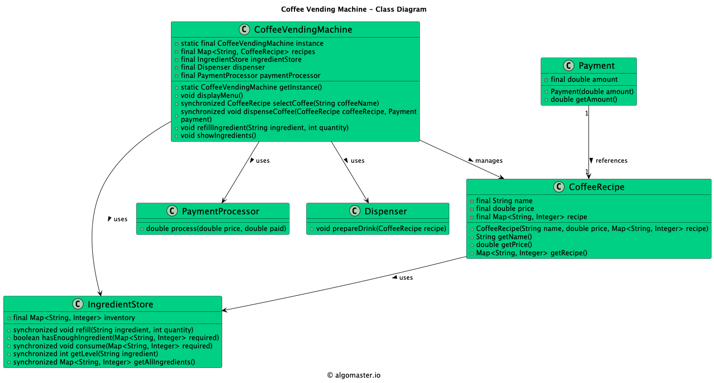

# Coffee Vending Machine (LLD)

## Problem Statement

Design and implement a Coffee Vending Machine system that can serve different types of coffee, manage ingredient inventory, process payments, and handle user interactions such as selecting coffee and refilling ingredients.

---

## Requirements

- **Multiple Coffee Types:** The machine should support multiple coffee recipes (e.g., Espresso, Latte, Cappuccino).
- **Ingredient Management:** The machine should track and manage ingredient levels, and prevent dispensing if ingredients are insufficient.
- **Payment Processing:** The machine should process payments before dispensing coffee.
- **Refill Ingredients:** The machine should allow refilling of ingredients.
- **Extensibility:** Easy to add new coffee types or payment methods.

---

## Core Entities

- **CoffeeVendingMachine:** Main class that manages the overall operation, user interaction, and coordinates other components.
- **CoffeeRecipe:** Represents a coffee recipe, including required ingredients and their quantities.
- **IngredientStore:** Manages the inventory of ingredients, supports checking and refilling.
- **Dispenser:** Handles the dispensing of coffee after successful payment and ingredient check.
- **PaymentProcessor:** Handles payment logic and validation.
- **Payment:** Represents a payment transaction.

---

## Class Design

## UML Class Diagram



### 1. CoffeeVendingMachine
- **Fields:** ingredientStore, paymentProcessor, Map<String, CoffeeRecipe> recipes, Dispenser
- **Methods:** selectCoffee(String), makeCoffee(String, Payment), refillIngredient(String, int), addRecipe(CoffeeRecipe), etc.

### 2. CoffeeRecipe
- **Fields:** name, Map<String, Integer> ingredients
- **Methods:** getName(), getIngredients()

### 3. IngredientStore
- **Fields:** Map<String, Integer> ingredientLevels
- **Methods:** hasIngredients(Map<String, Integer>), useIngredients(Map<String, Integer>), refill(String, int), getLevel(String)

### 4. Dispenser
- **Methods:** dispense(String)

### 5. PaymentProcessor
- **Methods:** processPayment(Payment)

### 6. Payment
- **Fields:** amount, paymentType, etc.

---

## Design Patterns Used

- **Strategy Pattern:** (Conceptually) for supporting different payment methods or coffee recipes.
- **Separation of Concerns:** Each class has a single responsibility (inventory, payment, dispensing, etc.).

---

## Example Usage

```ts
const coffeeVendingMachine = CoffeeVendingMachine.getInstance();

coffeeVendingMachine.refillIngredient("Milk", 70);
coffeeVendingMachine.refillIngredient("Coffee", 150);

coffeeVendingMachine.displayMenu();

const espresso = coffeeVendingMachine.selectCoffee("Espresso");
coffeeVendingMachine.dispenseCoffee(espresso, new Payment(3.0));
```

---

## Demo

See `CoffeeVendingMachineDemo.ts` for a sample usage and simulation of the coffee vending machine.

---

## Extending the Framework

- **Add new coffee types:** Create new `CoffeeRecipe` instances and add them to the machine.
- **Add new payment methods:** Extend `PaymentProcessor` to support new payment types.
- **Add new ingredients:** Update `IngredientStore` and recipes as needed.

---